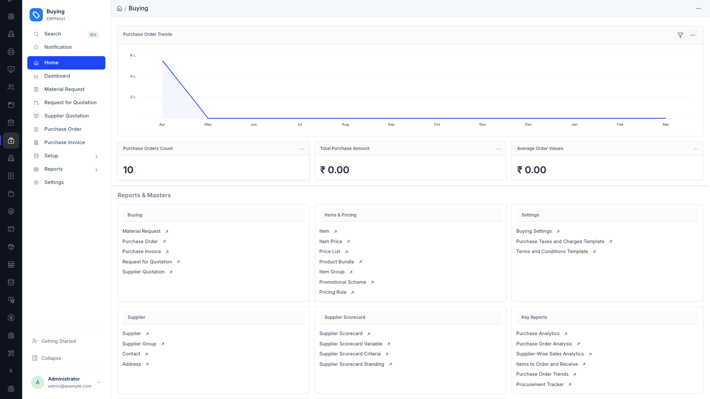
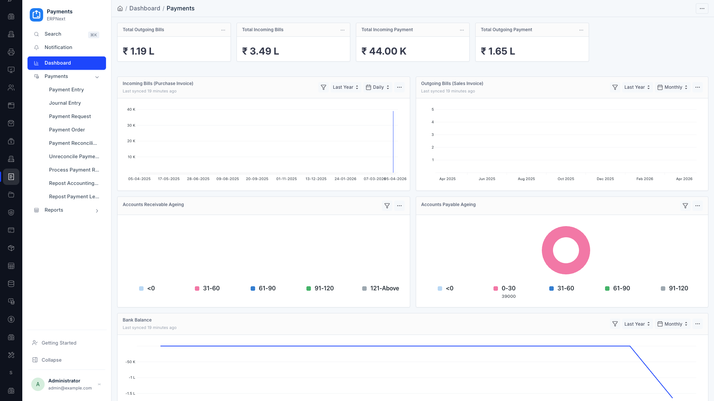
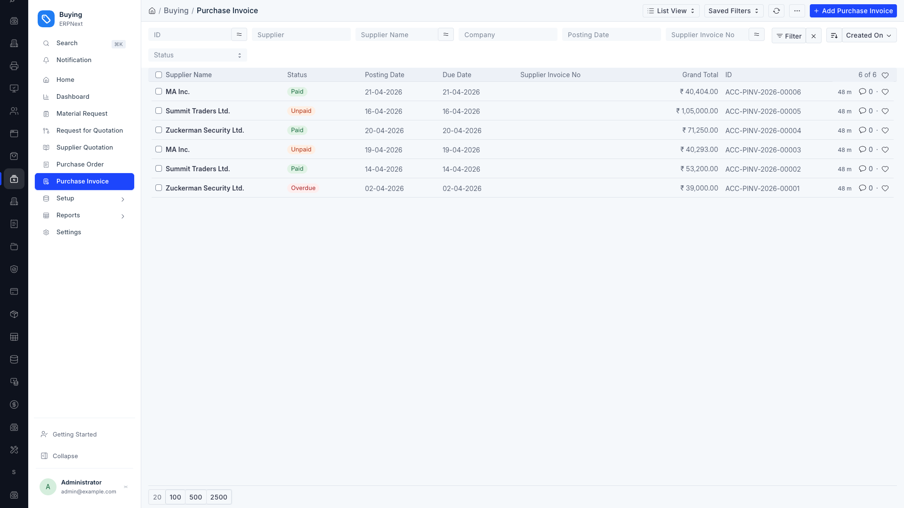
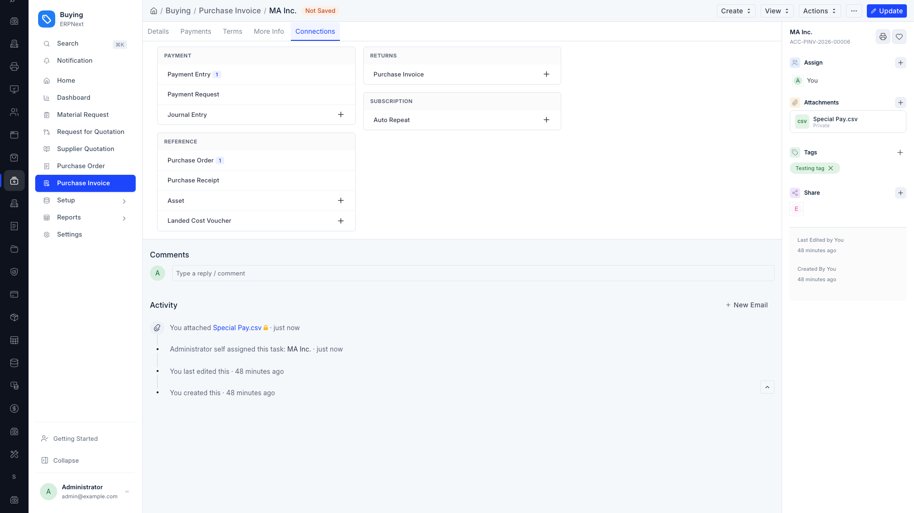
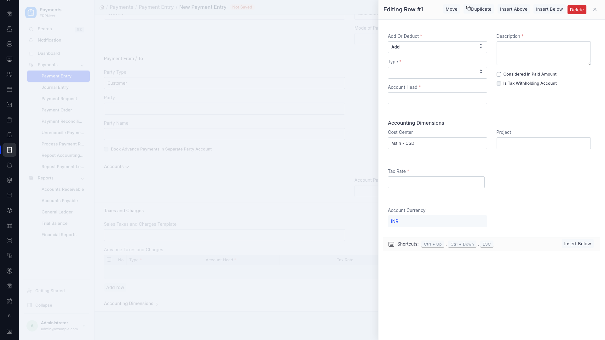
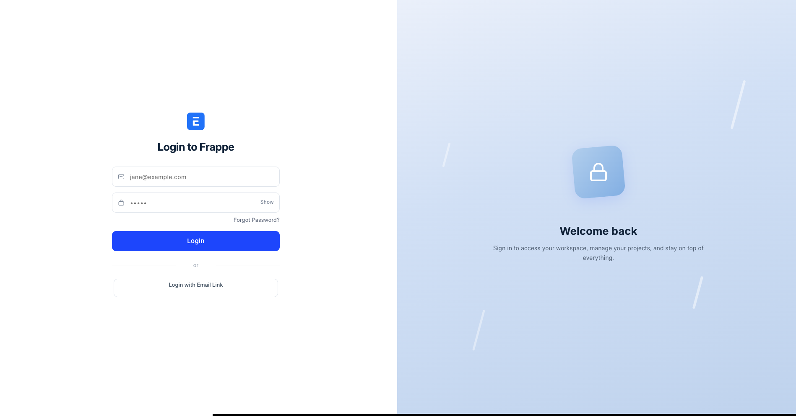
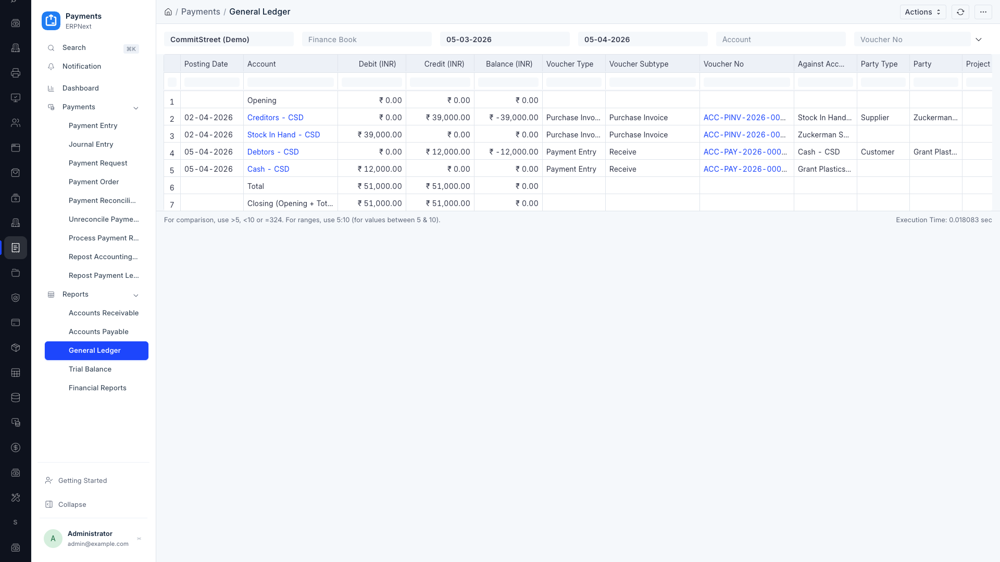
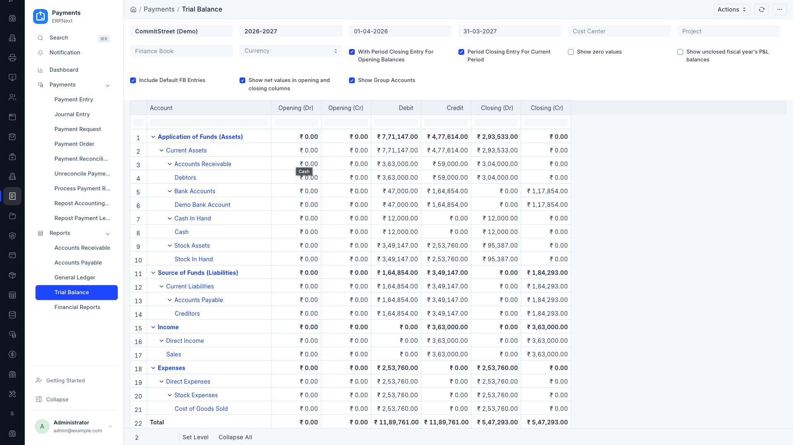

<p align="center">
  
</p>

<h1 align="center">Saas Theme</h1>

<p align="center">
  A modern, polished SaaS UI theme for <strong>Frappe Framework v16</strong> that transforms the default desk into a sleek, professional interface.
</p>

---

## Features

### Dual Sidebar with Workspace Rail
- Dark workspace rail (60px) with module icons for quick switching
- Sidebar panel with smooth expand/collapse behavior
- Tooltips on rail hover, active state indicators

### Redesigned Form UI
- Larger, squarish form inputs scoped to forms only (filters untouched)
- Active tabs styled with primary color border, background, and text
- Modern form right sidebar with colored section icons, enhanced attachment cards, and polished meta footer

### Slide-in Child Table Editor
- Child table row editing opens as a right-side sheet instead of a centered modal
- Full-height panel with slide-in animation, scrollable body, header/footer toolbars
- Close button and all action buttons always visible

### Enhanced Attachments
- File type badges (PDF, DOC, XLS, IMG, ZIP, CODE) with color coding
- Clean card layout with filename, privacy status, and remove button
- Auto-enhances dynamically added attachments via MutationObserver

### Dashboard Widgets
- Squarish card design with subtle header separation
- Chart colors overridden to primary blue
- Consistent hover effects across all widget types

### Connections Tab
- Grouped mini-cards with masonry layout (CSS columns)
- Uppercase section headers with subtle background
- Clean list rows with primary-colored count badges

### Login Page
- Two-column split layout with form on left and branded gradient panel on right
- Polished inputs, buttons, and social login styling
- Mobile responsive — panel hidden on small screens
- Dark mode support

### Desk Homepage
- Proper 6-column grid layout for workspace icons
- Hover effects with lift animation
- Responsive breakpoints (4 columns tablet, 3 columns mobile)

### User Menu
- Custom user menu triggered from sidebar avatar
- Profile info, integrations, logout, and version display

---

## Screenshots

### Workspace Home & Sidebar

*Dual sidebar with dark workspace rail, module icons, and Buying workspace*

### Dashboard

*Polished dashboard with number cards, charts in primary blue, and squarish widget cards*

### List View

*Clean list view with status indicators and styled filters*

### Connections Tab & Form Sidebar

*Grouped connection cards with masonry layout and redesigned right sidebar*

### Slide-in Child Table Editor

*Right-side sheet for editing child table rows with all actions visible*

### Login Page

*Two-column split login with branded gradient panel*

### Reports

*General Ledger report view*


*Trial Balance report with expandable tree view*

---

## Requirements

- Frappe Framework v16
---

## Installation

```bash
cd $PATH_TO_YOUR_BENCH
bench get-app https://github.com/vineyrawat/saas_theme.git --branch version-16
bench install-app saas_theme
bench build --app saas_theme
bench restart
```

## Update

```bash
cd $PATH_TO_YOUR_BENCH
bench update --apps saas_theme
bench build --app saas_theme
bench restart
```

## Uninstall

```bash
cd $PATH_TO_YOUR_BENCH
bench uninstall-app saas_theme
bench remove-app saas_theme
bench restart
```

---

## Configuration

No additional configuration required. The theme activates automatically on installation and applies to all desk pages.

To bust browser cache after updates, the asset version is incremented in `hooks.py`:
```python
app_include_css = "/assets/saas_theme/css/saas_theme.css?v=59"
app_include_js = "/assets/saas_theme/js/saas_theme.js?v=59"
```

---

## Compatibility

| Component | Version |
|-----------|---------|
| Frappe    | v16     |

---

## Support

For support, feature requests, or bug reports, contact:

- **Email**: vineyrawat@yahoo.com, vinay@vinay-rawat.dev
- **Publisher**: [Vinay Rawat](https://github.com/vineyrawat)

---

## License
MIT
